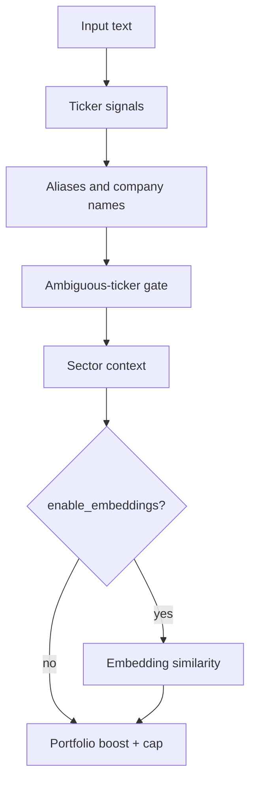

# Entity Linking Pipeline

How RSS articles get linked to tickers: ingest-time tagging, full enrichment, and fast retag.

## Overview

```
RSS ingest ──► rules-only linker (stage=ingest)
                    │
                    ▼
            article_company rows
                    │
     enrich pipeline ──► extract → sentiment → embeddings → linker (stage=enrichment)
                    │
                    ▼
            merge=True upsert (drops stale tags)
                    │
     retag (optional) ──► linker only on complete articles (rules-first by default)
                    │
                    ▼
            GET /api/news ──► confidence + strategy filter ──► ticker badges
```

Articles are matched against ~10k companies in SQLite. Matches are stored in `article_company` with a **match strategy**, **confidence**, and **extraction stage** (`ingest` or `enrichment`). The News UI only shows high-trust matches that pass a strategy whitelist.

| Path | Role |
|------|------|
| `app/services/ticker_matcher.py` | Cashtag / headline / body ticker signals |
| `app/services/company_aliases.py` | Curated + legal-name aliases, normalization |
| `app/services/entity_linking.py` | Multi-stage `EntityLinker` |
| `app/services/entity_linker_factory.py` | Linker + company-vector cache |
| `app/services/news.py` | Ingest-time linking (`stage=ingest`) |
| `app/services/article_pipeline.py` | Enrichment + `retag_batch` |
| `app/repositories.py` | `save_entity_matches`, news display SQL |

## Three entry points

### 1. Ingest (RSS worker / feed poll)

When a feed is polled, each new article is tagged immediately with a **fast, rules-only** pass:

- `create_entity_linker(..., enable_embedding_profiles=False)`
- `link_entities(text, stage="ingest", enable_embeddings=False)`
- No FinBERT, no article embeddings, no company embedding profiles

This gives usable ticker badges on `/news` within seconds of ingest. Tags are written with `extraction_stage = 'ingest'`.

### 2. Enrich (full NLP pipeline)

`ArticlePipeline.process_batch()` runs on articles with `pipeline_status` in `pending` or `error`:

1. **Extract** — fetch full article HTML when body is thin (`article_extraction.py`)
2. **Sentiment** — VADER + optional FinBERT (`sentiment_analysis.py`)
3. **Embeddings** — `all-MiniLM-L6-v2` article vectors; GPU batch when ≥8 articles and CUDA available
4. **Dedup** — cosine similarity ≥0.92 copies tags from the canonical article
5. **Entity link** — `link_entities(..., stage="enrichment", enable_embeddings=True)` on capped text
6. **Events** — rule + embedding event classification
7. **Market reaction** — abnormal return vs benchmark
8. **Rank** — composite `rank_score` for feed ordering

Entity matches are saved with `save_entity_matches(..., merge=True)`, which:

- Upserts new enrichment matches
- **Deletes all `ingest` tags** for that article
- **Deletes stale `enrichment` tags** not present in the new match set

### 3. Retag (linker only)

`ArticlePipeline.retag_batch()` re-runs entity linking on **already-complete** articles without re-running sentiment, events, or extraction. Defaults:

| Setting | Default | Why |
|---------|---------|-----|
| `enable_embeddings` | `false` | Avoids O(10k) company scan + embedding compute |
| `enable_finbert` | `false` | Not used for linking |
| `retag_all` | `true` | Re-tag every complete article, not just missing enrichment rows |

Retag batches bulk-fetch articles, reuse cached article embeddings when present, defer per-row commits, and commit once per batch. ~770 articles retag in **~4–5s** API time with rules-only settings.

## Linker stages (inside `EntityLinker.link_entities`)

Matching runs in order; results are merged per `company_id` (highest confidence wins), then capped at 8 matches.



### Stage 1 — Ticker signals (`ticker_matcher.py`)

Candidate tickers are derived only from:

- ALL-CAPS words in the text (`\b[A-Z]{2,6}\b`)
- Cashtags (`$NFLX`)
- Headline exchange forms (`(NFLX:`)

Mixed-case words like `Ad` or `Stock` are **not** scanned against the full ticker universe.

| Strategy | Confidence | Pattern |
|----------|------------|---------|
| `cashtag` | 0.98 | `$TICKER` |
| `headline_ticker` | 0.96 | ALL-CAPS in title lead (250 chars) or `(TICKER:` |
| `ticker_symbol` | 0.95 | Word-boundary match in body |

Regex patterns are cached (`lru_cache`) per ticker to avoid recompilation across articles.

### Stage 2 — Aliases and company names

Aliases come from `company_aliases` (seeded on linker creation):

| `alias_type` | Strategy | Confidence | Notes |
|--------------|----------|------------|-------|
| `curated` | `alias` | 0.88 | Hand-tuned (`netflix` → NFLX, `google` → GOOGL) |
| `name` (multi-word only) | `company_name` | 0.92 | Legal name from SEC; single-token names skipped |
| other | `company_alias` | 0.86 | Derived shards from legal name |

**Normalization** (`normalize_entity_text`): lowercase, strip possessives (`Netflix's` → `netflix`), remove corporate suffixes (`Inc`, `Corp`, …), collapse punctuation.

**Lookup optimization**: aliases are indexed by first token; only aliases whose first token appears in the article text are considered.

**False-positive guards**:

- `_SINGLE_TOKEN_ALIAS_BLOCKLIST` — prose words like `stock`, `billion`, `bull`, `game`
- Single-token `name` aliases are always skipped (e.g. company literally named "Research")
- Whole-word boundary matching for single-token aliases; phrase matching for multi-word

**Fuzzy names** (when company count ≤400 and `rapidfuzz` installed): multi-word legal names only, `partial_ratio` ≥0.94 → strategy `fuzzy_name`, confidence ≤0.85. Hidden from News display.

### Stage 3 — Ambiguous-ticker gate

Short or English-colliding tickers (`AD`, `TD`, `BULL`, `NET`, …) require extra evidence unless the match already came from a high-trust source:

| Passes gate automatically | Requires finance context or title-lead ALL-CAPS |
|---------------------------|------------------------------------------------|
| `cashtag`, `headline_ticker` | bare `ticker_symbol` for ambiguous tickers |
| `company_name`, `alias`, `company_alias`, `fuzzy_name` | |
| alias hit on same company | |

Finance context is detected via `FINANCE_CONTEXT_RE` (earnings, revenue, shares, guidance, …).

### Stage 4 — Sector context

If finance context is present and a normalized sector/industry label appears in text → strategy `sector_context`, confidence 0.72. Not shown on News.

### Stage 5 — Embedding similarity (optional)

When `enable_embeddings=True` and an article vector exists:

- Compare against pre-built company profile vectors (name + ticker + sector + industry)
- Scan portfolio-boosted tickers first, then up to 200 company profiles
- Similarity ≥0.52 → strategy `embedding`, confidence capped at 0.82
- Skipped for companies already matched at ≥0.80 confidence

Embedding matches are stored in `article_company` but **excluded from News badges** (see below).

### Portfolio boost

Tickers in the user's portfolio/watchlist get +0.03 confidence when already in the 0.72–0.92 range (from `repo.get_boosted_tickers()`).

## Input text cap

Entity linking does not scan the full article body. `build_entity_link_text()` concatenates:

```
title + summary + body[:remaining]
```

Default cap: **12,000 characters**. Entity mentions in finance news are almost always in the lead.

## News display filter

`GET /api/news` and `GET /api/ticker/<t>/news` only surface matches that pass **both**:

1. `confidence >= 0.85`
2. `match_strategy` in `NEWS_DISPLAY_MATCH_STRATEGIES`:

```
cashtag, headline_ticker, alias, company_name, company_alias
```

Excluded from badges (still stored in DB):

| Strategy | Why hidden |
|----------|------------|
| `ticker_symbol` | Body-level `$`-less matches are noisy |
| `fuzzy_name` | Approximate string match |
| `sector_context` | Industry mention ≠ company story |
| `embedding` | Semantic similarity, lower interpretability |

Maximum **6 tickers** per article in the API response.

## Data model

### `company_aliases`

```sql
company_id, alias, alias_type, normalized_alias  -- UNIQUE (company_id, normalized_alias)
```

Seeding (`repo.seed_company_aliases()`):

1. `upsert_curated_company_aliases()` — always refreshes hand-curated rows
2. One-time bulk insert of `name`-type aliases from `companies` table

### `article_company`

```sql
article_id, company_id, match_type, match_strategy, confidence,
extraction_stage, evidence_text, embedding_similarity
-- PRIMARY KEY (article_id, company_id)
```

On conflict, a new row replaces the old one only when `excluded.confidence >= article_company.confidence`.

## API and scripts

### Endpoints

| Method | Path | Purpose |
|--------|------|---------|
| POST | `/api/admin/enrich-articles` | Full enrichment batch; `retag_only=true` for linker-only |
| POST | `/api/admin/retag-articles` | Dedicated retag endpoint |
| GET | `/api/admin/enrich-articles/status` | Pipeline counts + retag candidates |

Common JSON body fields:

```json
{
  "limit": 50,
  "offset": 0,
  "enable_embeddings": false,
  "enable_finbert": false,
  "retag_all": true,
  "force": false
}
```

### `enrich_articles.sh`

```bash
./restart.sh                              # required after code changes
./enrich_articles.sh                      # enrich pending → auto retag
RETAG=1 RETAG_ALL=1 BATCH=100 ./enrich_articles.sh   # retag only (~5s)
FAST=1 ./enrich_articles.sh               # CPU-only enrich, no FinBERT/embeddings
FORCE=1 FAST=1 ./enrich_articles.sh       # requeue all + fast re-enrich
SLEEP_SECONDS=0 RETAG=1 RETAG_ALL=1 ./enrich_articles.sh
RETAG_EMBEDDINGS=1 RETAG=1 RETAG_ALL=1 ./enrich_articles.sh  # slow semantic retag
```

| Env var | Effect |
|---------|--------|
| `FAST=1` | `enable_finbert=false`, `enable_embeddings=false` |
| `RETAG=1` | Skip enrichment; retag complete articles only |
| `RETAG_ALL=1` | Retag all complete articles (default when `RETAG=1`) |
| `RETAG_EMBEDDINGS=1` | Enable semantic matching during retag (slow) |
| `FORCE=1` | Requeue completed articles for full re-enrichment |
| `SKIP_RETAG=1` | Skip automatic post-enrichment retag pass |

## Rules vs semantic

| Mode | Speed | Typical use |
|------|-------|-------------|
| **Rules** (default retag) | ~5s / 770 articles | Production News badges; explicit tickers and names |
| **Semantic** (`enable_embeddings=true`) | Minutes per large batch | Discovery of tangentially related companies; stored but not badged |

GPU is used only during **full enrichment** (FinBERT + embeddings) when batch size ≥8 and CUDA is available (`NLP_DEVICE=auto`). Retag and ingest are CPU-only by default.

## Performance notes

| Optimization | Location |
|--------------|----------|
| Candidate tickers from ALL-CAPS/cashtags only | `ticker_matcher.match_ticker_signals` |
| Cached regex patterns per ticker | `ticker_match_patterns` |
| Token-indexed alias lookup | `EntityLinker._alias_by_token` |
| 12k-char text cap | `build_entity_link_text` |
| Linker instance cache | `entity_linker_factory._linker_cache` |
| Company vector cache | `entity_linker_factory._company_vectors_cache` |
| Bulk article fetch + deferred commit | `retag_batch` |
| Reuse cached article embeddings on retag | `get_article_embedding_vector` |

## Tuning and debugging

**After code changes**, restart the backend (`./restart.sh`). The enrich script checks for `api_features.retag_endpoint` and exits with a clear message if the running process is stale.

**Verify a single article:**

```bash
curl -s "http://localhost:5000/api/news?limit=5" | python3 -m json.tool
```

**Inspect raw matches in SQLite:**

```sql
SELECT c.ticker, ac.match_strategy, ac.confidence, ac.extraction_stage, ac.evidence_text
FROM article_company ac
JOIN companies c ON c.id = ac.company_id
WHERE ac.article_id = ?
ORDER BY ac.confidence DESC;
```

**Tests:**

```bash
python -m pytest app/tests/test_entity_linking.py app/tests/test_ticker_matcher.py -q
```

Key regression cases: NFLX meme post avoids `stock`/`billion` false positives; `merge=True` drops stale enrichment tags after retag.

## Adding curated aliases

Edit `CURATED_ALIASES` in `app/services/company_aliases.py`, then restart the API. Curated rows are upserted on every linker creation:

```python
CURATED_ALIASES = {
    "NFLX": ["netflix"],
    "GOOGL": ["google", "alphabet"],
    # ...
}
```

Curated aliases take precedence over auto-derived `name` duplicates and are never blocked by the single-token noise filter.
