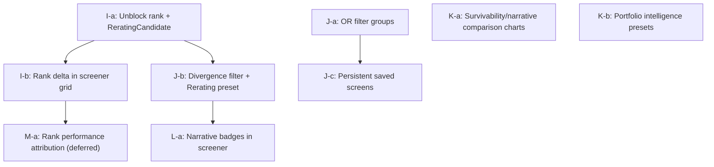

# Research Intelligence Evolution Plan

## What already exists (do not rebuild)

Before any implementation: most Phase I–L infrastructure is already present.

| Phase | Already built |
|---|---|
| I — Composite ranking | `composite_ranking.py` with `deep_value` + `turnaround` presets, `company_rank_snapshots` table, `CompositeFactorPanel`, `CompositeRankHistory`, factor bar visualization |
| J — Screening | `screening.py` with AND-logic composable filters, 10 screen presets in `screenPresets.js`, `filterEvidence` response per filter |
| K — Comparative | `CompareMetricsPanel` (5 tickers, charts, percentile ranks), portfolio presets (Standard, Deep Value, Distressed, Insider) |
| L — Narrative divergence | `NarrativePanel`, `company_narrative_snapshots` with `divergence_score`/`divergence_signal`, `/api/research/narrative/:ticker` |

The composite ranking routes (`/api/research/rank`, `/api/research/rank/history/:ticker`) are **gated behind feature flag `experimental_research_composite_rank`** — this is the single biggest blocker to using Phase I features.

## Execution order (incremental, validate after each sub-phase)

---

### Sub-phase I-a — Unblock composite ranking + add ReratingCandidate preset

**What's missing:** Composite ranking is locked behind a feature flag; the `ReratingCandidate` preset (improving fundamentals + negative sentiment divergence + insider accumulation) doesn't exist.

**Files (4):**
- [`app/routes/research.py`](../app/routes/research.py) — remove feature flag gate from `/rank` and `/rank/history` routes (or promote flag to default-on with admin toggle, not hard 403)
- [`app/services/composite_ranking.py`](../app/services/composite_ranking.py) — add `rerating_candidate` preset: factors `sentiment_divergence` (0.30), `insider_conviction` (0.25), `gross_margin_recovery` (0.20), `survivability` (0.15), `altman_improvement` (0.10)
- [`stock_tracker_frontend/src/config/compositePresets.js`](../../stock_tracker_frontend/src/config/compositePresets.js) — add `rerating_candidate` entry + factor labels
- [`stock_tracker_frontend/src/components/research/CompositeFactorPanel.js`](../../stock_tracker_frontend/src/components/research/CompositeFactorPanel.js) — remove the "enable in Admin" disabled-state; show factor bars unconditionally when data present

**Validation:** Tier 2 — `pytest app/tests/test_scoring.py -q --maxfail=1 -x` + manual `curl /api/research/rank?composite=rerating_candidate&universe=sp500&limit=20`

---

### Sub-phase I-b — Rank movement indicators in screener grid

**What's missing:** The `ScreenPage` grid shows composite scores but not rank delta (↑/↓ since last snapshot). `company_rank_snapshots` already stores history.

**Files (3):**
- [`app/services/composite_ranking.py`](../app/services/composite_ranking.py) — include `rank_delta` (current rank vs prior snapshot 7d ago) in rank result rows
- [`stock_tracker_frontend/src/pages/ScreenPage.js`](../../stock_tracker_frontend/src/pages/ScreenPage.js) — add `rankDelta` column (arrow + number, colored green/red)
- [`stock_tracker_frontend/src/config/compositePresets.js`](../../stock_tracker_frontend/src/config/compositePresets.js) — expose `rankDelta` label

**Validation:** Tier 1 — verify `rank_delta` in API response; visual check in `/screen` with composite rank enabled

---

### Sub-phase J-a — OR filter groups in screening engine

**What's missing:** `screening.py` only supports a flat `filters[]` array (implicit AND). No OR grouping. This is the main expressiveness gap.

**Proposed spec extension** (backward-compatible — flat `filters[]` still works as AND group):
```json
{
  "filter_groups": [
    { "op": "AND", "filters": [ {"metric": "pb", "op": "lt", "value": 0.7} ] },
    { "op": "OR", "filters": [ {"metric": "buy6m", "op": "gte", "value": 500000}, {"metric": "cluster_count", "op": "gte", "value": 3} ] }
  ]
}
```

**Files (3):**
- [`app/services/screening.py`](../app/services/screening.py) — extend `_validate_spec` + `run_composable_screen` to support `filter_groups[]` alongside legacy flat `filters[]`
- [`app/tests/test_screening.py`](../app/tests/test_screening.py) — add tests for OR group logic (create if not exists)
- [`stock_tracker_frontend/src/pages/ScreenPage.js`](../../stock_tracker_frontend/src/pages/ScreenPage.js) — UI for adding filter groups with AND/OR toggle (collapsible group headers)

**Validation:** Tier 2 — `pytest app/tests/test_screening.py -q`

---

### Sub-phase J-b — Rerating Candidates screen preset + divergence filter

**What's missing:** `divergence_score` is not a screenable field in `screening.py`. The "Rerating Candidates" preset doesn't exist in `screenPresets.js`.

**Files (2):**
- [`app/services/screening.py`](../app/services/screening.py) — add `divergence_score` and `divergence_signal` as filterable derived fields (join `company_narrative_snapshots`)
- [`stock_tracker_frontend/src/config/screenPresets.js`](../../stock_tracker_frontend/src/config/screenPresets.js) — add `rerating_candidates` preset: improving Piotroski (≥5), positive gross margin trend, divergence_score (gte threshold), insider buying cluster

**Validation:** Tier 2 — `curl -X POST /api/research/screen` with divergence filter; verify `filterEvidence` includes divergence field

---

### Sub-phase J-c — Persistent saved screens (localStorage)

**What's missing:** Users can't save custom filter combinations. Presets are read-only.

**Files (2):**
- [`stock_tracker_frontend/src/pages/ScreenPage.js`](../../stock_tracker_frontend/src/pages/ScreenPage.js) — "Save screen" / "Clone preset" UI; persists to localStorage under a `savedScreens` key
- [`stock_tracker_frontend/src/utils/savedScreens.js`](../../stock_tracker_frontend/src/utils/savedScreens.js) — CRUD helpers (`getSaved`, `saveScreen`, `deleteScreen`, `clonePreset`)

No backend changes needed (localStorage only; can wire to watchlist API later if needed).

**Validation:** Tier 1 — functional test: save, reload page, verify screen persists

---

### Sub-phase K-a — Survivability + narrative divergence comparison charts

**What's missing:** `CompareMetricsPanel` compares Revenue, Gross Margin, Piotroski F, Altman Z — but not Survivability trend or Narrative divergence score trend (both valuable for distressed-but-survivable comparisons).

**Files (1):**
- [`stock_tracker_frontend/src/components/research/CompareMetricsPanel.js`](../../stock_tracker_frontend/src/components/research/CompareMetricsPanel.js) — add Survivability and Divergence Score to `COMPARE_CHARTS` array; use existing `GET /api/research/ticker/:ticker` data (already includes survivability history and narrative)

**Validation:** Tier 1 — visual check with 2–3 distressed tickers in compare panel

---

### Sub-phase K-b — Portfolio intelligence view presets

**What's missing:** Portfolio presets (Standard, Deep Value, Distressed, Insider Activity) don't yet include Margin Recovery, Cyclical Exposure, or Narrative Divergence views.

**Files (1):**
- [`stock_tracker_frontend/src/config/portfolioPresets.js`](../../stock_tracker_frontend/src/config/portfolioPresets.js) — add `margin_recovery` (columns emphasizing gross/operating/FCF margins + trend deltas), `cyclical_exposure` (PE/PB/EV-EBITDA + margin trend), `narrative_divergence` (divergence score badge column + insider activity)

**Validation:** Tier 0 — visual check in `/` portfolio grid

---

### Sub-phase L-a — Narrative state badges in research screener

**What's missing:** The `/research` comparative heatmap grid doesn't show narrative state (turnaround optimism, bankruptcy fear, etc.) as a column. Users have to navigate to deep dive to see it.

**Files (2):**
- [`stock_tracker_frontend/src/config/researchMetrics.js`](../../stock_tracker_frontend/src/config/researchMetrics.js) — add `narrativeDivergence` column to `SCREENER_METRIC_GROUPS` (a non-heatmap badge column)
- [`stock_tracker_frontend/src/components/research/FinancialGrid.js`](../../stock_tracker_frontend/src/components/research/FinancialGrid.js) or `ResearchPage.js` — render divergence signal pill (bullish/bearish/neutral) using existing `narrativeDivergence.signal` already returned by `/api/research/screener`

**Validation:** Tier 1 — verify `/api/research/screener` returns divergence fields; visual check in `/research?tickers=...`

---

### Sub-phase M-a — Rank performance attribution (deferred — needs plan approval)

**What's needed:** Compare `company_rank_snapshots` composite scores at T=0 against price performance at T+30/90/180 days. Requires joining `prices` table against historical snapshots by date.

**Files (estimated 4–5):** new `app/services/rank_validation.py`, new `/api/research/rank/validation` route, new `RankValidationPanel.js` component, tests.

**Status:** Plan approval required before implementation (Tier 4 — new service + new route + schema join).

---

## Dependency diagram



## Files NOT touched

`scoring.py`, `metric_registry.py`, `metrics_engine.py`, `scoringColors.js`, `heatMap.js`, `metricRegistry.js` — no changes unless a sub-phase explicitly requires it. Canonical scoring architecture is preserved throughout.
