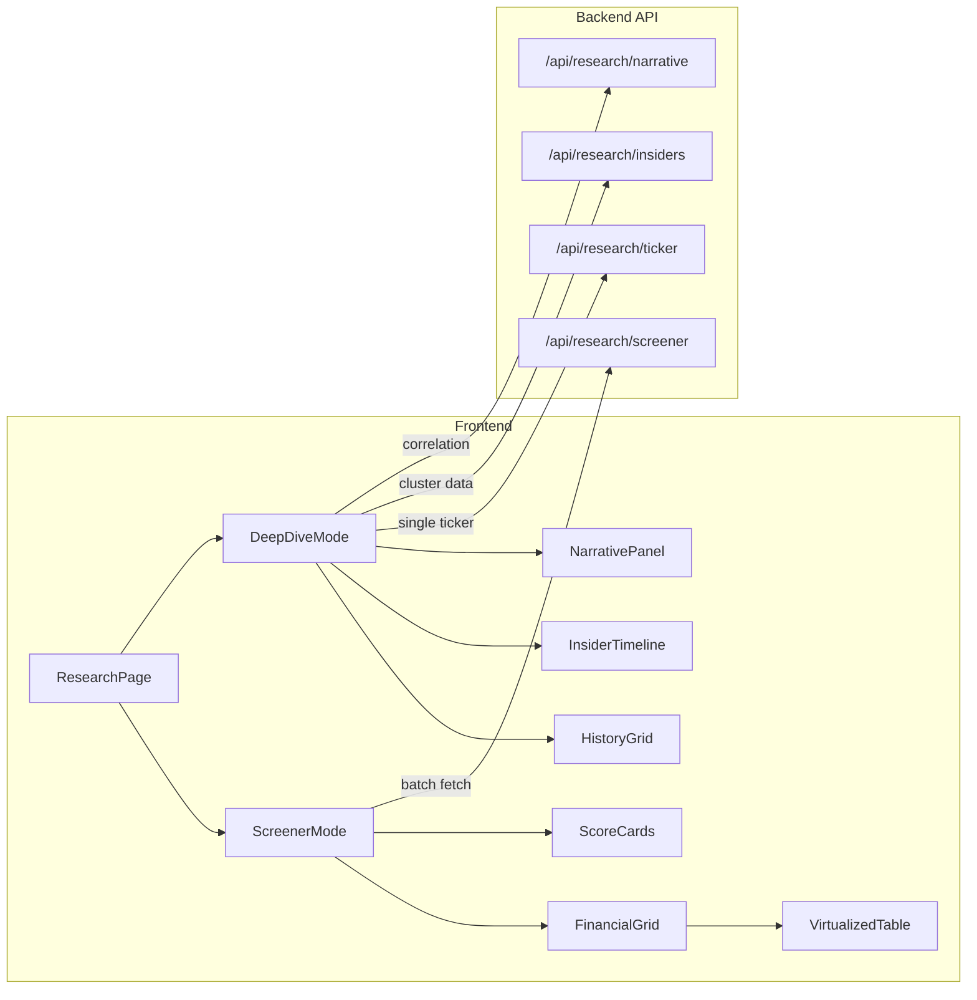
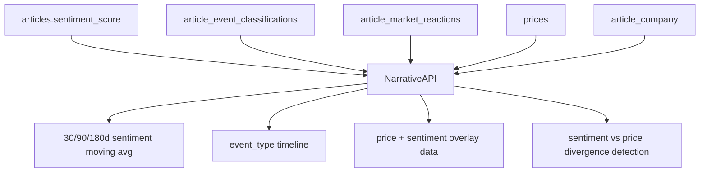

# Deep Value Research Page — Architecture Plan

## Current State Summary

**Backend data already available:**
- 45+ SEC fundamental metrics per company-period (revenue through sbcomp), pivoted into SHARADAR-style wide rows with annual/quarterly/TTM support
- 20+ derived ratios in `build_company_metrics()`: P/E, EV/EBITDA, ROE, ROA, gross margin, net margin, D/E, current ratio, P/B, P/S, FCF/share, div yield, etc.
- Insider transactions from SEC Form 4: owner_name, transaction_code (P/S/A/D/…), shares, price, value, filing_date, transaction_date
- Price history (Stooq/yfinance): OHLCV per ticker per date
- Sentiment pipeline: VADER + FinBERT labels/scores per article
- Market reactions: `article_market_reactions` with return_1d, return_1w, abnormal_return_1d
- Event classification: `article_event_classifications` with event_type + confidence
- Entity linking with confidence scores and match strategies
- ~10k companies with ticker, name, CIK, sector, industry

**Frontend libraries already in use:**
- React 18, React Bootstrap, React Router
- ApexCharts (charting)
- Custom `DataGrid` component with sorting, column toggling, heatmap coloring, sticky headers
- Custom heatmap utilities (`heatMap.js`), formatters, portfolio helpers
- Dark/light theme system via CSS variables
- No virtualization library yet (DataGrid renders all rows in DOM)

**Key gaps to fill for this page:**
- No Piotroski F-score, Altman Z-score, or Beneish M-score computation
- No margin trend / CAGR / rolling average calculations
- No insider cluster analysis (buy intensity, timing patterns)
- No institutional/whale tracking (13F data not ingested)
- No narrative-to-price correlation engine
- No virtualized grid for 100+ row rendering
- Several P1 SEC metrics still missing from `SEC_METRIC_CONFIG` (cor, gp, opex, sgna, rnd, etc. — mapped in `RAW_COLUMNS` but not always populated from XBRL)

---

## Page Architecture

### Route and Layout

- Route: `/research` (or `/research/:ticker` for single-stock deep-dive)
- Nav label: **Research** (between Portfolio and Screener)
- Layout: full-width, minimal padding, no container constraints — maximize horizontal density

### Three operational modes

1. **Screener mode** (`/research`) — multi-ticker comparative grid, spreadsheet-style layout
2. **Deep-dive mode** (`/research/:ticker`) — single company with full history, scoring, insider timeline, news correlation
3. **Watchlist mode** — research grid filtered to a saved watchlist



---

## React Component Hierarchy

```
ResearchPage
  ResearchToolbar          (ticker input, watchlist selector, period toggle, export)
  ResearchScreener         (multi-ticker mode)
    ScoreSummaryBar        (Piotroski/Altman/Beneish mini badges per ticker)
    FinancialGrid          (virtualized, spreadsheet-dense)
      MetricGroupHeader    (expandable: Income, Balance Sheet, Cash Flow, Ratios, Scores)
      MetricRow            (heatmapped cells, inline sparklines, YoY arrows)
      PeriodColumnHeader   (FY2020..FY2025, Q1..Q4, TTM)
    InsiderClusterPanel    (compact table: ticker, insider buys last 90d, intensity score)
  ResearchDeepDive         (single-ticker mode)
    CompanyHeader          (ticker, name, price, sector, quick scores)
    HistoricalGrid         (10-year financials, quarterly + annual)
    MarginTrendChart       (gross/operating/net/FCF margins over time)
    ScoringPanel           (Piotroski breakdown, Altman components, Beneish flags)
    CapitalStructurePanel  (debt maturity proxy, leverage trend, liquidity)
    InsiderActivityPanel   (timeline chart, cluster detection, buy/sell ratio)
    NarrativeCorrelation   (linked articles with sentiment vs price overlay)
```

---

## Backend API Design

### New endpoints (all under `/api/research/`)

| Method | Path | Purpose |
|--------|------|---------|
| GET | `/api/research/screener` | Batch fundamentals + scores + insider summary for N tickers |
| GET | `/api/research/ticker/<ticker>` | Full historical financials + all scores + insider detail |
| GET | `/api/research/insiders/<ticker>` | Insider cluster analysis for one ticker |
| GET | `/api/research/insiders/clusters` | Cross-ticker insider buy intensity ranking |
| GET | `/api/research/narrative/<ticker>` | Sentiment trend + event timeline + price correlation |
| GET | `/api/research/scores` | Batch Piotroski/Altman/Beneish for a ticker list |

### Screener endpoint detail

`GET /api/research/screener?tickers=AAPL,GME,AMC&dimension=MRY`

Returns per ticker:
- Latest wide row (all 45+ metrics)
- Derived ratios (from `build_company_metrics`)
- **New:** Piotroski F-score (0-9), Altman Z-score, Beneish M-score
- **New:** Margin trends (gross_margin 3yr delta, operating_margin 3yr delta)
- **New:** Share dilution rate (sharesbas YoY change)
- **New:** Insider buy intensity (90d buy count, buy/sell ratio, total value)
- Latest price + 52-week range
- Sector/industry

### Deep-dive endpoint detail

`GET /api/research/ticker/GME`

Returns:
- Full 10-year annual + quarterly fundamentals (all periods, not just mostRecent)
- All derived metrics per period (margins, ratios, per-share values)
- Score history (Piotroski per year, Altman per year)
- Insider transactions (all Form 4 records for this company)
- Insider cluster analysis (windows of concentrated buying)
- Recent articles with sentiment + market reaction data
- Price history for the sparkline/overlay period

---

## Scoring Models — Backend Implementation

### 1. Piotroski F-Score (9-point)

New file: [app/services/scoring.py](stock_tracker_backend/app/services/scoring.py)

Computed from existing SEC data — all inputs already in `fundamentals` table:

| # | Signal | Metric source | Test |
|---|--------|--------------|------|
| 1 | ROA | netinc / assets | > 0 |
| 2 | Operating CF | ncfo | > 0 |
| 3 | Delta ROA | YoY ROA change | improving |
| 4 | Accruals | ncfo > netinc | quality |
| 5 | Delta leverage | debt/assets YoY | decreasing |
| 6 | Delta liquidity | current ratio YoY | improving |
| 7 | No dilution | sharesbas YoY | not increasing |
| 8 | Delta gross margin | gp/revenue YoY | improving |
| 9 | Delta asset turnover | revenue/assets YoY | improving |

All 9 inputs are available from existing wide rows. Implementation: pure Python function over two consecutive annual periods.

### 2. Altman Z-Score

```
Z = 1.2*(WorkingCapital/Assets) + 1.4*(RetainedEarnings/Assets)
  + 3.3*(EBIT/Assets) + 0.6*(MarketCap/Liabilities) + 1.0*(Revenue/Assets)
```

Inputs available: `workingcapital`, `retearn`, `ebit`/`opinc`, `assets`, `liabilities`, `revenue`, `marketCap` (needs price). All exist in current schema.

Zones: >2.99 safe, 1.81-2.99 grey, <1.81 distress.

### 3. Beneish M-Score (8 variables)

Requires two consecutive annual periods. Most inputs available:

| Variable | Formula | Available? |
|----------|---------|-----------|
| DSRI | (receivables/revenue) YoY | Yes |
| GMI | gross_margin YoY inverse | Yes (needs gp populated) |
| AQI | (1 - (current_assets + PPE) / assets) YoY | Yes |
| SGI | revenue YoY | Yes |
| DEPI | depreciation rate YoY | Yes (depamor) |
| SGAI | (sgna/revenue) YoY | Partial (sgna not always populated) |
| LVGI | (liabilities/assets) YoY | Yes |
| TATA | (netinc - ncfo) / assets | Yes |

M > -1.78 suggests earnings manipulation. Return None when insufficient data rather than guessing.

### 4. Survivability Score (custom composite)

Weighted combination of:
- Current ratio (liquidity)
- Cash / total debt (coverage)
- FCF positive streak
- Interest coverage (ebit / interestexp)
- Altman Z proximity to distress
- Debt-to-equity trend

Score 0-100, bucketed: Critical / Distressed / Watchlist / Stable / Strong.

---

## Database Schema Additions

### New table: `company_scores`

```sql
CREATE TABLE IF NOT EXISTS company_scores (
    id INTEGER PRIMARY KEY AUTOINCREMENT,
    company_id INTEGER NOT NULL,
    period_end TEXT NOT NULL,
    dimension TEXT NOT NULL DEFAULT 'ARY',
    piotroski_f INTEGER,
    altman_z REAL,
    beneish_m REAL,
    survivability REAL,
    -- Component storage for drill-down
    piotroski_components TEXT,  -- JSON: {"roa":1,"cfo":1,...}
    altman_components TEXT,     -- JSON: {"wc_ta":0.12,...}
    computed_at TEXT NOT NULL DEFAULT CURRENT_TIMESTAMP,
    FOREIGN KEY (company_id) REFERENCES companies(id) ON DELETE CASCADE,
    UNIQUE (company_id, period_end, dimension)
);
```

### New table: `insider_cluster_analysis`

Materialized view of insider buying windows, computed by background worker:

```sql
CREATE TABLE IF NOT EXISTS insider_cluster_analysis (
    id INTEGER PRIMARY KEY AUTOINCREMENT,
    company_id INTEGER NOT NULL,
    window_start TEXT NOT NULL,
    window_end TEXT NOT NULL,
    buy_count INTEGER NOT NULL DEFAULT 0,
    sell_count INTEGER NOT NULL DEFAULT 0,
    unique_buyers INTEGER NOT NULL DEFAULT 0,
    total_buy_value REAL,
    total_sell_value REAL,
    avg_buy_price REAL,
    intensity_score REAL,  -- normalized 0-1
    computed_at TEXT NOT NULL DEFAULT CURRENT_TIMESTAMP,
    FOREIGN KEY (company_id) REFERENCES companies(id) ON DELETE CASCADE,
    UNIQUE (company_id, window_start, window_end)
);
```

No new tables needed for scoring history per se — `company_scores` covers it. Insider raw data is already in `insider_transactions`.

---

## Insider Cluster Analysis — Computation

New service: [app/services/insider_analysis.py](stock_tracker_backend/app/services/insider_analysis.py)

From existing `insider_transactions` data:

1. **Buy intensity score** — rolling 90-day window: `(buy_count * ln(total_buy_value)) / days_active`
2. **Cluster detection** — 3+ unique insiders buying within 30 days = cluster event
3. **Buy/sell ratio** — transaction count and value ratios over 90d/180d/365d
4. **Officer vs director** — Form 4 `security_title` parsing for role inference
5. **Historical insider return** — did price go up 6/12 months after cluster? (needs price data correlation)

---

## Whale / Institutional Tracking — Free Data Sources

SEC 13F filings are free via EDGAR but require new ingestion:

- `https://efts.sec.gov/LATEST/search-index?q="13F"&dateRange=custom&startdt=...` — EDGAR full-text search
- `https://data.sec.gov/submissions/CIK{cik}.json` — get recent filings including 13F-HR
- Parse 13F XML for holdings: cusip, shares, value

**Phase this separately** — 13F ingestion is a substantial new pipeline. For Phase 1, use existing insider data (Form 4) which is already ingested. Add a curated `WHALE_CIKS` map for known deep-value funds (Scion/Burry, Greenlight/Einhorn, etc.) and flag when their CIKs appear in Form 4 insider transactions or future 13F holdings.

---

## Narrative Correlation Engine — Architecture

Uses existing infrastructure:



Backend computation (new function in a narrative service):
- Aggregate `sentiment_score` by ticker over rolling windows (30d, 90d, 180d)
- Detect divergence: improving sentiment + falling price (or vice versa)
- Rank recent events by `abnormal_return_1d` magnitude
- Cluster articles by `event_type` and time proximity

No new tables needed — query joins across `article_company`, `articles`, `article_market_reactions`, and `prices`.

---

## Frontend — Grid Virtualization Strategy

The current `DataGrid` renders all rows in DOM. For 100+ companies x 50+ metrics, this will be slow.

**TanStack Table v8 is already installed** (`@tanstack/react-table` ^8.21.3). The existing `DataGrid` component wraps it with column groups, sticky columns, heatmap `cellStyle`, compact mode, and chunk-based incremental rendering.

**What is missing:** True DOM-recycling virtualization. The current `DataGrid` renders all loaded rows (chunk-appended on scroll). For 500+ companies x 50+ metrics, add **`@tanstack/react-virtual`** (~5KB) to window only visible rows. The research grid should either extend `DataGrid` with a virtual row renderer or build a dedicated `VirtualizedGrid` that shares the same column/heatmap conventions.

**Unused grid deps to clean up:** `react-tabulator`, `tabulator-tables`, `@svar-ui/react-grid` are installed but not used in any component.

### Heatmap / Conditional Formatting

Extend existing `heatMap.js` with new scales:
- Margin heatmap: red (negative) → white (0) → green (high)
- Score heatmap: Piotroski 0-3 red, 4-6 yellow, 7-9 green
- Z-score: <1.81 red, 1.81-2.99 amber, >2.99 green
- Trend arrows: inline SVG ▲/▼ with magnitude-based color

### Sparklines

Use existing ApexCharts in sparkline mode (`chart.sparkline.enabled: true`) for:
- 5-year margin trend per metric row
- 52-week price mini-chart in the ticker header
- Insider buy/sell volume bars

---

## State Management

No new state library needed. Current pattern (page-level `useState` + `useEffect` fetch) works. For the research page specifically:

- `useReducer` for complex filter/sort/column-visibility state
- URL search params for shareable state (`?tickers=GME,AMC&dim=MRY&sort=piotroski`)
- `useMemo` aggressively for derived computations (margins, YoY, CAGR)
- Optional: `react-query` / `@tanstack/react-query` for caching API responses across tab switches (but not required for Phase 1)

---

## Caching Strategy

**Backend:**
- Scores are materialized in `company_scores` — computed once per filing, not per request
- Insider cluster analysis is materialized in `insider_cluster_analysis`
- Narrative aggregation cached in memory with TTL (sentiment doesn't change frequently)
- Fundamentals already cached in SQLite; API reads are fast

**Frontend:**
- Research page caches last fetch in component state
- Switching annual/quarterly re-fetches but is fast (SQLite reads)
- Ticker deep-dive data persisted in state while navigating sub-tabs

---

## Implementation Phases

### Phase 1 — Scoring engine + API (backend only, ~2 days)

- `app/services/scoring.py`: Piotroski F-score, Altman Z-score, Beneish M-score, survivability score
- `company_scores` table + migration in `db.py`
- Score computation integrated into `refresh_fundamentals` (compute after upsert)
- `GET /api/research/screener` endpoint returning fundamentals + scores + insider summary
- `GET /api/research/ticker/<ticker>` endpoint returning full history + scores
- Tests for all four scoring models against known company data

### Phase 2 — Research page shell + financial grid (frontend, ~2-3 days)

- Add `@tanstack/react-virtual` for true windowed row rendering (TanStack Table already installed)
- `ResearchPage` route at `/research`
- `ResearchToolbar` — ticker input, watchlist selector, period toggle
- `FinancialGrid` — virtualized, column-pinned, grouped metrics
- Heatmap cell renderer using extended `heatMap.js`
- Inline sparklines via ApexCharts sparkline mode
- YoY calculation + CAGR display in grid cells
- Keyboard navigation (arrow keys, tab through cells)

### Phase 3 — Scoring panels + insider analysis (both, ~2 days)

- `ScoringPanel` component with Piotroski/Altman/Beneish breakdowns
- `ScoreSummaryBar` for screener mode (compact badge row)
- `app/services/insider_analysis.py` — cluster detection, intensity scoring
- `insider_cluster_analysis` table + migration
- `InsiderClusterPanel` (screener) and `InsiderActivityPanel` (deep-dive)
- `GET /api/research/insiders/<ticker>` and `/insiders/clusters`

### Phase 4 — Narrative correlation + deep-dive mode (~2 days)

- `app/services/narrative.py` — sentiment aggregation, divergence detection
- `GET /api/research/narrative/<ticker>`
- `NarrativeCorrelation` component — sentiment trend + price overlay
- `ResearchDeepDive` layout with all panels
- `MarginTrendChart` using ApexCharts line/area
- `CapitalStructurePanel` — debt composition, leverage trend

### Phase 5 — Polish + advanced features (~2 days)

- Export to CSV/clipboard from grid
- URL-based state persistence for shareable research views
- Cross-ticker comparison mode (select 2-5 tickers, overlay metrics)
- Batch score computation in background worker (nightly after fundamentals refresh)
- REFACTOR_PLAN.md update

### Post-Phase 5 follow-up (June 2026) — in progress

Phase 6 (fundamentals screener + score-threshold universe filters) is **deferred** for a separate pass.

| Task | Status | Notes |
|------|--------|-------|
| Phase 3b SEC metrics audit | **mostly done** | `SEC_METRIC_CONFIG` expanded; `opinc` derived from gp−opex |
| MR/TTM snapshot materialization | **done** | Persist `MRY`/`MRQ`/`MRT` rows after fundamentals refresh |
| `$+` insider cluster screener | **done** | `/screener?mode=cluster` + `min_buy_value` on clusters API |
| Bulk sector/industry enrichment | **done** | `POST /api/admin/enrich-metadata?all=true` + nightly worker job |
| Admin observability | **done** | `companyScoresUpdatedAt`, missing-sector count, narrative reaction coverage |
| Research / narrative tests | **done** | Snapshot dimension + admin coverage tests |
| Market-reaction backfill | **ops** | `./backfill_market_reactions.sh` for narrative panels |

### Phase 6 — deferred

- Fundamentals universe screener (filter by P/E, scores, sector without ticker list)
- Factor-driven opportunity discovery (score combination thresholds)

### Future (not in initial build)

- 13F institutional holdings ingestion (whale tracking)
- Curated whale fund CIK map + Form 4 cross-reference
- Historical analog detection (embedding similarity across event clusters)
- Custom scoring model builder (user-defined weighted composites)

---

## Key Files to Create or Modify

### New backend files
- `app/services/scoring.py` — Piotroski, Altman, Beneish, survivability
- `app/services/insider_analysis.py` — cluster detection, intensity
- `app/services/narrative.py` — sentiment aggregation, divergence
- `app/routes/research.py` — new blueprint for `/api/research/*` endpoints
- `app/tests/test_scoring.py` — score model unit tests

### Modified backend files
- [app/db.py](stock_tracker_backend/app/db.py) — `company_scores` + `insider_cluster_analysis` tables
- [app/__init__.py](stock_tracker_backend/app/__init__.py) — register research blueprint
- [app/services/fundamentals.py](stock_tracker_backend/app/services/fundamentals.py) — trigger score computation after refresh

### New frontend files
- `src/pages/ResearchPage.js` — main page component
- `src/components/research/FinancialGrid.js` — virtualized metric grid
- `src/components/research/ScoringPanel.js` — score breakdowns
- `src/components/research/InsiderPanel.js` — insider cluster visualization
- `src/components/research/NarrativePanel.js` — sentiment/price correlation
- `src/components/research/ResearchToolbar.js` — controls
- `src/utils/scoringColors.js` — heatmap scales for scores

### Modified frontend files
- [src/App.js](stock_tracker_frontend/src/App.js) — add `/research` route
- `package.json` — add `@tanstack/react-table`, `@tanstack/react-virtual`

---

## Performance Considerations

- **Grid rendering**: TanStack Virtual only mounts visible rows; 500 companies x 50 metrics remains smooth
- **API response size**: screener endpoint returns ~2KB per ticker (wide row + scores + insider summary); 100 tickers = ~200KB — acceptable
- **Score computation**: pure arithmetic over 2 annual periods; <1ms per ticker; can be done at request time or materialized
- **SQLite reads**: fundamentals pivot is the heaviest query; already optimized with indexes; under 50ms for 100 tickers
- **Sparkline rendering**: ApexCharts sparklines are lightweight SVG; dozens render without jank
- **Dark theme**: all new components inherit CSS variable system from existing `themes.css`
